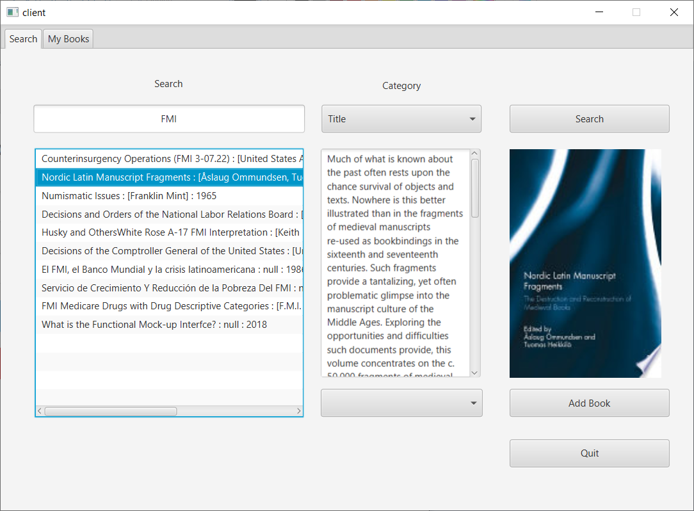
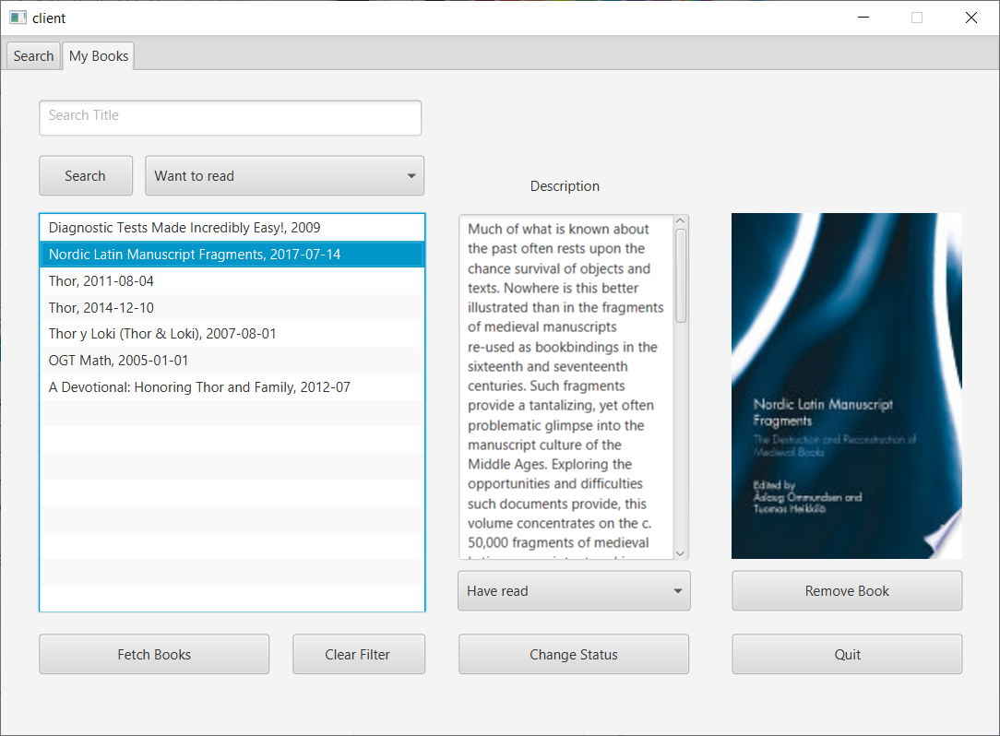

# Bookhub

This project aims to design and implement an application, which provides users the ability to explore, preview and
add books, journals and papers to personalized library collection. It uses GoogleBooks service as a digital database
for the book materials. The application uses a client-server architecture, in which the client side is a desktop
application with a graphical user interface.

## Module use diagram

## Sample screenshots

### Login

### Search

### Book collections

